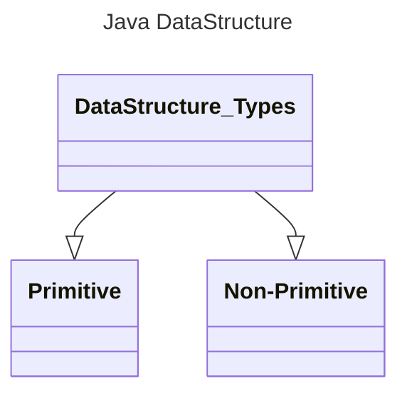
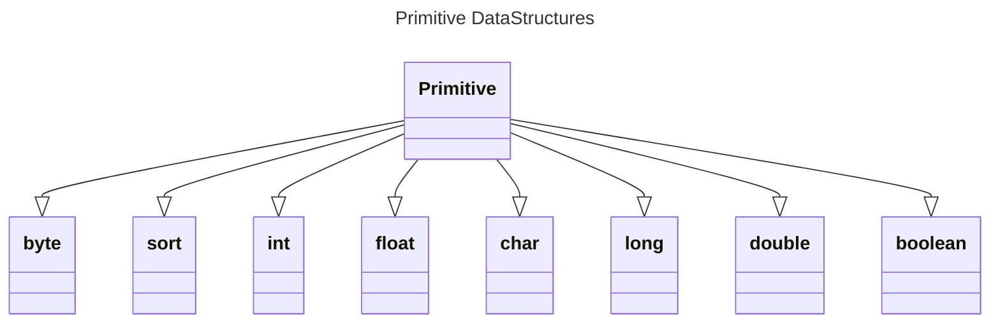
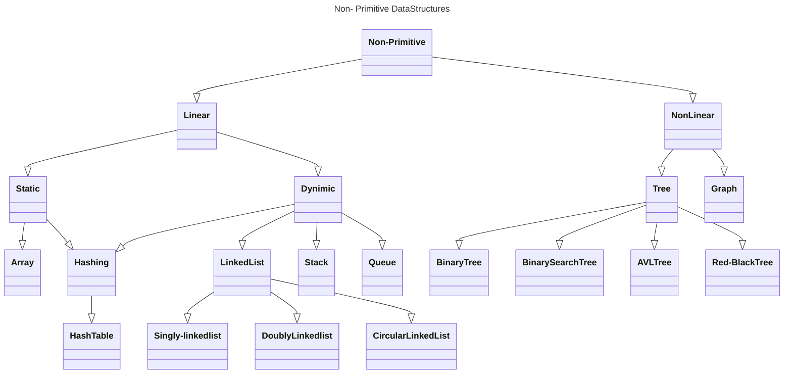
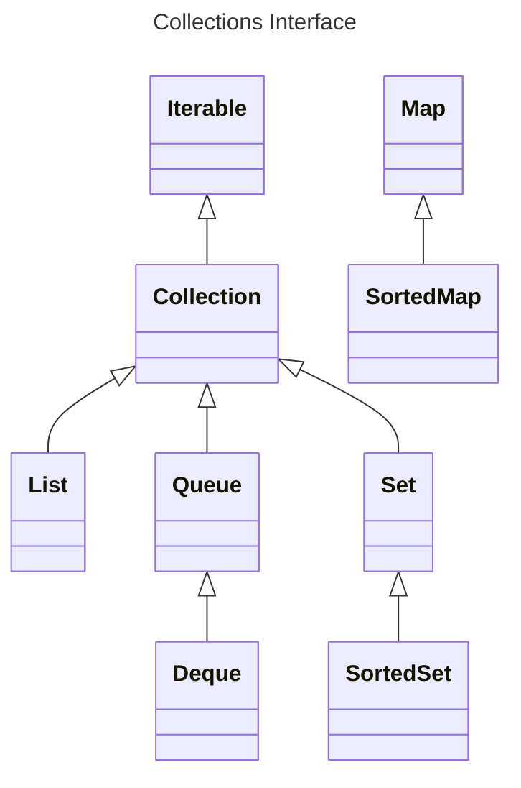
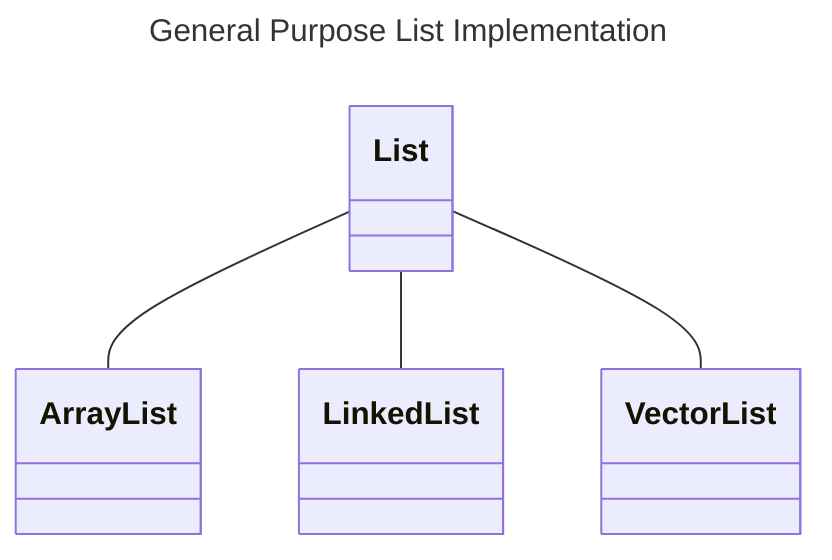
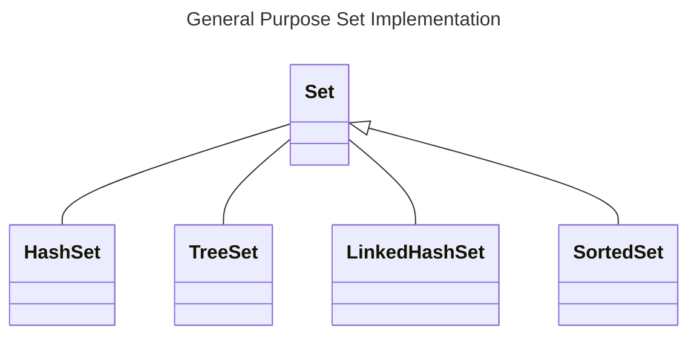
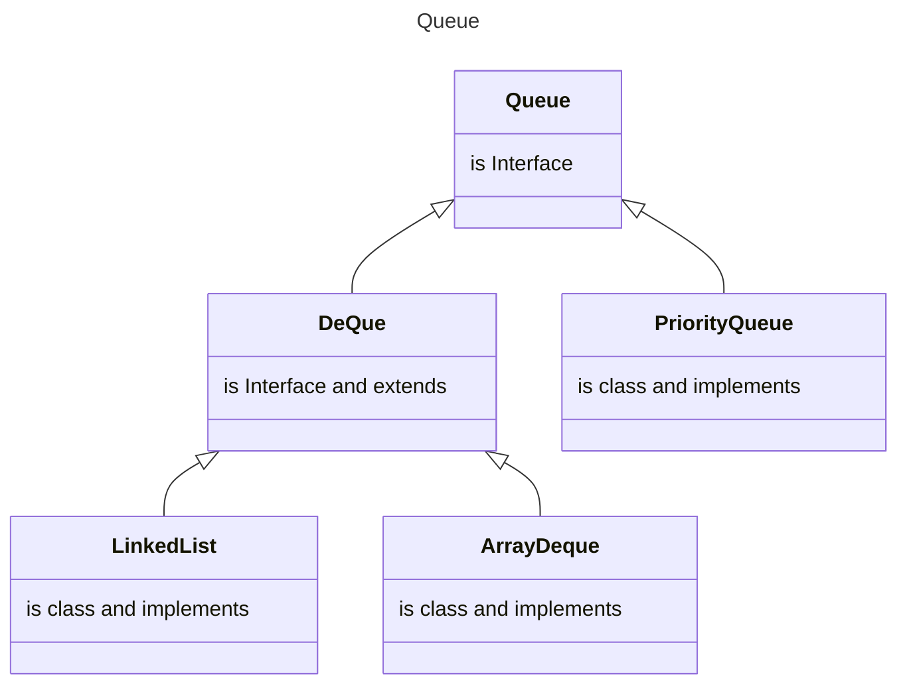
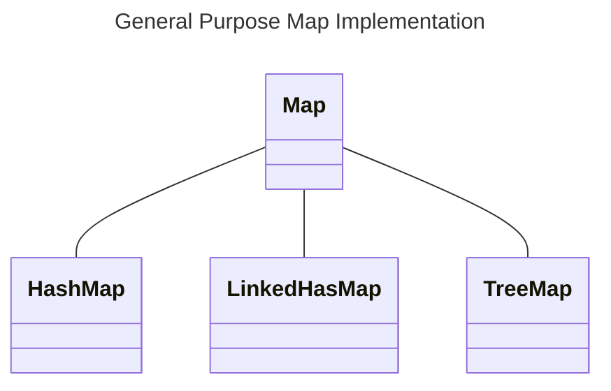
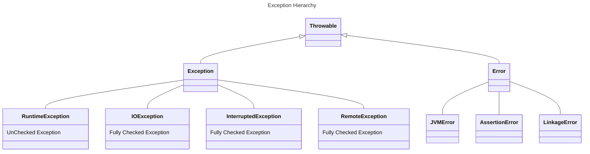

## Basics
- Primitives are actual values and non-primitives are references. 
- #### Arthematic Operators 
    - Add(+)  
    - Substract (-)  
    - Multiplication (*)  
    - Division (/)  
    - Modulus (%)
      - returns remainder of a division  
    - ***Precedence of Operations*** (*  /  % ) >  ( +  -)  
- #### Comparison Operators
   - Equal to (==)  
   - Not Equal to (!=)  
   - Greater than (>)  
   - Less Than (<)  
   - Greater than or equal to(>=)  
   - Less than or equal to (<=)
- #### Logical Operators
  - **&&**  **Logical and**(Returns true if both statements are true)
  - **||**  **Logical or**(Returns true if one of the statements is true)
  - **!**   **Logical not**(Reverse the result, returns false if the result is true)

- #### Ternary Operators
- Java Ternary operator is the only conditional operator that takes three operands.
- It is basically one line replacement for if-then-else.

        Example:
          variable = Condition_Expression ? Expression1:Expression2

_________________________________________________________________________________
_________________________________________________________________________________

### String
- String class represents character strings, String is immutable in Java.
- When we create a String using double quotes, JVM first looks for the String with the same value in the string pool. If found, it returns the reference of the string object from the pool. Otherwise, it creates the String object in the String pool and returns the reference.
- String uses UTF-16 encoding for the character stream.
### String Builder & String Buffer
- Since String is immutable in Java, whenever we do String manipulation like concatenation, substring, etc. it generates a new String and discards the older String for garbage collection.
- StringBuffer is Synchronized, StringBuilder, which is similar to StringBuffer except for thread-safety and synchronization.
- Java has provided StringBuffer and StringBuilder classes that should be used for String manipulation.
- StringBuffer and StringBuilder are mutable objects in Java.
- They provide append(), insert(), delete(), and substring() methods for String manipulation.

    #### References:
    - [String API Doc](https://docs.oracle.com/javase%2F9%2Fdocs%2Fapi%2F%2F/java/lang/String.html#:~:text=The%20String%20class%20represents%20character,String%20buffers%20support%20mutable%20strings.)
    - [StringBuffer API Doc](https://docs.oracle.com/javase%2F9%2Fdocs%2Fapi%2F%2F/java/lang/StringBuffer.html)
    - [StringBuilder API Doc](https://docs.oracle.com/javase%2F9%2Fdocs%2Fapi%2F%2F/java/lang/StringBuilder.html)

    - **String Methods**

        - stringVariable.endswith("");
        - stringVariable.remove("");
        - stringVariable.toCharArray();
        - stringVariable.charAt(index);
        - 
        - stringVariable.trim(); --removing leading and trail white space
        - stringVariable.startsWith(); or stringVariable.startsWith(stringPrefix, int SpecifyBegingingIndex);
        - stringVariable.substring(begniging index); or stringVariable.substring(startIndex,endIndex);
        - stringVariable.split(string expression); or stringVariable.split(expression, limitIndex);
        - 
        - stringVariable.replace(oldChar,newChar);
        - stringVariable.replaceAll(String Regex,String replacement);
        - stringVariable.replaceFirst(tring Regex,String replacement);
        - 
        - stringVariable.length();
        - stringVariable.isEmpty();
        - stringVariable.indexOf(string); or stringVariable.indexOf(char); or stringVariable.indexOf(string, fromIndex);
        - stringVariable.lastIndexOf(string); same emthods as above

        - stringVariable.matches(string regex);
        - stringVariable.equals(Object); compares 2 objects
        - stringVariable.equalsIgnoreCase(Object); compares 2 objects
        
        - stringVariable.contains(charSequence);
        - stringVariable.copyValueOf(char[] data);

___________________________________________________________________
___________________________________________________________________

## OOPS

### Constructor
- Java provides default constructor for the classes if no constructor is declared.

### Inheritance

### Interface
- Objects cannot be created for Java Interface i.e. it will not have constructors and cannot be declared as new Interface();
- Interface class can extend another Interface
- Interface will have un-implemented methods i.e. method signatures. 
- Concrete Classes that **implements** Interface has to implement the Methods.
- When Abstract class implements and Interface Class then abstract class can provide implementation for some or none of the methods in the Interface.
- Concrete class that extends abstract has to provide implementation for all the abstract methods in abstract class and the Interface that Abstract class is extending.
- From Java-8 static method implementation in Interface is allowed. We can create default methods also need to use **default keyword** for method.
- From java-9 non-static methods can also be created but has to be private.
- Concrete class can override the implementation of method in interface.

### Abstract
- Abstract class can have Constructors, But they cannot be instantiated directly.
- the constructors are used when concrete subclass is created. [Click for More Info](https://www.javatpoint.com/constructor-in-abstract-class-in-java#:~:text=Abstract%20classes%20can%20have%20constructors,by%20means%20of%20the%20class.)
- Abstract class will have Abstract Methods and non-Abstract Methods.
- Abstract clas can have member variables also.
- **abstract** is the key word.
- When abstract class **extends** another abstract class no need to implement for the abstract methods.

### Encapsulation

### Polymorphism
- Ability to take different forms of an object is caled polymorphism.

___________________________________________________________________
___________________________________________________________________
## Collections & Data Structures

### [Data Structures](https://www.mygreatlearning.com/blog/data-structures-using-java/#what-are-data-structures-in-java)

- Java Data Structures are classified into 2 types Linear and nonLinear.

___

- Static Data structures whose size is declared and fixed at Compile Time and cannot be changed later are called Static Data structures.
- Dynamic Data Structures whose size is not fixed at compile time and can be decided at runtime depending upon requirements are called Dynamic Data structures.
- Few other types of DataStructures are 
   - **Heap**
- ***Array***
  - Array is the simplest data structure where a collection of similar data elements takes place and each data element can be accessed directly by only using its index number.

---------------------------------------------------

### [Collection Types](https://docs.oracle.com/javase/tutorial/collections/interfaces/index.html)
The Core Collection interface encapsulates different types of collections like below.

- ***Collection***
    - Root of the collection hierarchy.
    - Some types of collections allow duplicate elements, and others do not.
    - Some are ordered and others are unordered
    - **Collections Cannot use Primitive Data Types** instead they have to use Wrapper Classes of primitive types.
    - Wrapper classes provide a way to use primitive data types as objects.

| Primitive type | Wrapper Class |
|----------------|---------------|
| byte           | Byte          |
| short          | Short         |      
| int            | Integer       |
| long           | Long          |
| flot           | Float         |
| double         | Double        |
| boolean        | Boolean       |
| char           | Character     |

-------------------------------------------------------------------

- ***List***
    - Ordered collection (sometimes called a sequence).
    - Lists can contain duplicate elements.
        - ***ArrayList***
            - Underlying Data Structure is Array.
        - ***LinkedList***
            - Underlying Data Structure is LinkedList.
            - Insertion and deletion operations in LinkedList is efficient.
        - **VectorList**
            - Underlying Data Structure is Array.
            - All methods are **Synchronized** i.e thread safe.
    ###### Examples
       List<String> testArrayList = new ArrayList<String>();
       List<String> testLinkedList = new LinkedList<String>();
       List<String> testVectorList = new VectorList<String>();
       List<Integer> testArrayList = new ArrayList<Integer>();

- list.of(); [immutable list i.e once created cannot be changed].
- list.add("");
- list.addAll(newList);
- list.add(2,"AtThisIndex")
- List.set(6,"element at this index will be replaced with this value");
- list.remove(basedOnIndex);
- list.remove("StringValue");
- numbersListVarible.indexOf(22);
- numbersListVariable.remove(index) or numbersListVariable.remove(Object)
- Collections.sort(numbersListVariable);

    - Iterating around the list can be done in 3 ways:

                1. Regular for loop.
                2. Enhanced For Loop.
                3. Usingg Iterator class.

                   Iterator<String> iteratorVariable = listVariable.iterate();
                   while(iteratorVariable.hasNext()){
                   //DO SOME LOGIC    
                   }
--------------------------------------------------------------------

- ***Set***
    - Collection that cannot contain duplicate elements ****(Unique elements)****.
        - ***HashSet***
            - Stores its elements in a hash table.
            - No guarantees concerning the order of iteration. **_[no order]_**
        - ***TreeSet***
            - Stores its elements in a red-black tree.
            - Orders its elements based on their values. **_[Sorted order]_**
            - Tree sets have additional methods than List and Linked List since it implements ***NavigableSet***.
            - **[12,24,27,52,66,89,90]** below are ***methods*** on this sorted Tree Set.
              1. numbersTreeSet.floor(25); //24 less than equal to lower than 27 and this is inclusive
              2. numbersTreeSet.lower(24); //12 this is not inclusive, less than
              3. numbersTreeSet.ceiling(28); //52 greater than equal to
              4. numbersTreeSet.higher(27); //  greater than
              5. numbersTreeSet.subSet(25,50); // 27,lower is inclusive and upper limit is exclusive
              6. numbersTreeSet.subSet(27,false,80,true); //boolien is used to explicitly call inclusive or exclusive
              7. numbersTreeSet.headSet(27); // returns all below this number
              8. numbersTreeSet.tailSet(27); //returns all above this number
        - ***LinkedHashSet***
            - Implemented as a hash table with a linked list running through it.
            - Orders its elements based on the order in which they were inserted into the set. **_[insertion-order]_**
    - ***SortedSet***
        - Set that maintains its elements in ascending order.
        - Several additional operations are provided to take advantage of the ordering.

    ##### Examples
        Set<Integer> num = new HashSet<>(); 
        Set<Integer> num = new LinkedHashSet<>(); 
        Set<Integer> num = new TreeSet<>();

-----------------------------------------------------------------------

- ***Queue***
    - Collection used to hold multiple elements prior to processing.
    - Besides basic Collection operations, a Queue provides additional insertion, extraction, and inspection operations.
    - Queues typically, but do not necessarily, order elements in a **FIFO** (first-in, first-out) manner.
    - Queue is used to insert elements at the end of the queue and removes from the beginning of the queue. It follows FIFO concept.
    - In a FIFO queue, all new elements are inserted at the tail of the queue.
    - Insertion order is not maintained, instead elements are stored based on the priority order which is ascending by default.
    - Interface the queue needs a concrete class for the declaration and the most common classes are
      - PriorityQueue 
      - LinkedList
      - PriorityBlockingQueue (Thread-Safe Implementation)

    ##### Examples
        Queue<Obj> queue = new PriorityQueue<Obj> (); [ascending by default.]
        Queue<Integer> queue = new PriorityQueue<Integer> (); [ascending by default.]
        Queue<String> queue = new LinkedList<>();
        Queue<Integer> pbq = new PriorityBlockingQueue<Integer>();

- ***Deque*** ("double-ended queue")
    - Collection used to hold multiple elements prior to processing.
    - Besides basic Collection operations, a Deque provides additional insertion, extraction, and inspection operations.
    - Deques can be used both as **FIFO** (first-in, first-out) and **LIFO** (last-in, first-out).
    - In a deque all new elements can be inserted, retrieved and removed at both ends.

    ##### Examples
        Deque<Integer> deque = new ArrayDeque<>();
        Deque<String> deque = new LinkedList<String>();

- In addition to Collection **Methods** it supports below:
  1. .add();
  2. .offer();
  3. .remove();
  4. .poll();
  5. .peek();        

-----------------------------------------------------------

- ***Map***
    - Map do not implement collection interface, part of collection framework but it does not implement collection interface.
    - An object that maps keys to values.
    - A Map cannot contain duplicate keys; each key can map to at most one value.
    - Behavior and performance are precisely analogous to HashSet, TreeSet, and LinkedHashSet.
        - ***HashMap***
          - Unsorted and unordered.
          - HashMap allows to store key,value with null value's.
          - **HashTable** same as hashMap but synchronized.
        - ***LinkedHashMap***
          - Insertion order is maintained
        - ***TreeMap***
          - Data is stored in sorted order.
          - TreeMap also implements NavigableMap
              - TreeMap ONLY Methods
                - treeMap.higherKey(" ");
                - treeMap.ceilingKey(" ");
                - treeMap.lowerKey(" ");
                - treeMap.floorKey(" ");
                - treeMap.firstEntry(" ");
                - treeMap.lastEntry(" ");
                - treeMap.subMap("from","to");
                - treeMap.subMap("from",true,"to",true);
    - ***SortedMap***
      - Map that maintains its mappings in ascending key order.
      - This is the Map analog of SortedSet.
      - Sorted maps are used for naturally ordered collections of key/value pairs.

  - **Some Methods:**
      - .size();
      - .isEmpty();
      - .containsKey();
      - .containsValue();
      - .get();
      - .put(k,v);
      - .remove(k);
      - .putAll();
      - .clear();
      - .keySet(); -- will give all the Keys
      - .values(); -- will return all the values

    ##### Examples
        Map<Integer,String> map = new HashMap<>(); {no order}
        Map<Integer,String> map = new HashTable<>(); {no order}
        Map<Integer,String> map = new LinkedHasMap<>(); {Insertion Order}
        Map<Integer,String> map = new TreeMap<>(); {Sorted order}
---------------------------------------------------------------------------
__________________________________________________________________________

## Generics

## Functional Programming
- Functional Interfaces 
  - PREDICATES?
  - 
- **Stream** has two operations 
  - Intermediate Operations output is typically a Stream.
  - ##### Example of Intermediate Operations are: 
          .filter()
          .sorted()
          .reduce()
          .distinct()
          .map()
  - Terminal operation output is either to consume entire stream or return one result back.

- ### LambdaExpression
- **Lambda** is shortcut for method
  - Syntax for multiple line implementation of body : **_(Parameters) -> { Multiple line of codes, Explicit return}_**
  - Syntax **_(Parameters) -> Single line of codes No-Explicit return_**
  

## MultiThreading

- Two ways of creating a thread 
    1. Extends Thread
    2. Implements Runnable
- Stages/LifeCycle of Thread
  - NEW
  - RUNNABLE
  - RUNNING
  - BLOCKED/WAITING
  - TERMINATED/DEAD
- Priority for Specific Task/thread
  - taskThread.setPriority(Priorityvalue);
  - Priority value can be from 1 to 10; 1 is min and 10 is max, 5 is by default to all threads;
- Communication between Threads
  - task.join(); will wait till this task/thread is completed
- Executor service
  - More better way to create manage and process threads based on logic;
    - ExecutorService es = Executors.newSingleThreadExecutor();
    - es.shutdown();
    - For specifiying how many threads can run at a time
      - ExecutorService es = Executors.newFixedThread(threadCount);

## Exception Handling

- ***Exception Hierarchy***

- Checked Exception vs Unchecked Exception
  - Checked exceptions should be implements if any method uses a class or method that extends Checked exception.
  - Unchecked exception is caused due to bad data or bad programmer.
- Creating a custom Exception.

## Concurrency
- Locks is alternate to Synchronize. Synchronized is for entire methood rather Lock is for specific piece of code at the required point.
- **Atomic Classes** 

## Tips
- Code blocks
  - Anything between {} is called code block.
  - There can be static code block in a class.
- **_Access Modifiers_** for methods, variables and classes
  - **public**
  - **private** [Cannot use on class]
  - **(default)**
  - **protected** [Cannot use on class] [if a class gets extended by sub class this methods can be used]
- **_Non Access Modifiers_**
  - **final**
    - If a class is declared with final, that class cannot be extended.
      - public final className{}
    - If a method is declared final, method cannot be overridden.
    - If a variable is declared final, once initialized it cannot be changed.
    - If an argument is declared final, we cannot change the value of argument inside the method
      - public void methodName(final String argument){}
  - **static**
    - If a variable is declared static, it is shared across multiple instances of that class.
    - If a method is declared static, it can be called without an instance of the class.
    - Static Methods cannot use instance methods or instance variables. However, in non-static methods we can use static variables or methods.
- **_Nested Classes_**
  - A class can be created inside the class, we can create in 2 types.
    - **Inner Class**
      - To create instance of this inner class I need Instance of parent/enclosing class.
    - **static Inner class**
      - An instance of this static inner class can be created.
- **_Anonymous Class_**
  - Any class that do not have a name is called Anonymous class. Typically, can be used in Methods.
- **_Enum_**
  - Example 
       enum season{ WINTER,SUMMER}

## Java New Fetures java 10 to 16
- Java Modularization
  - java --list-modules
  - Instead of one rt.jar (runtime jar) from java 8 since the size is growing up they have dividived rt.jar into multiple modules.
  - require module;
  - require transitive module
  - export package;
  - opens package.a to module.b